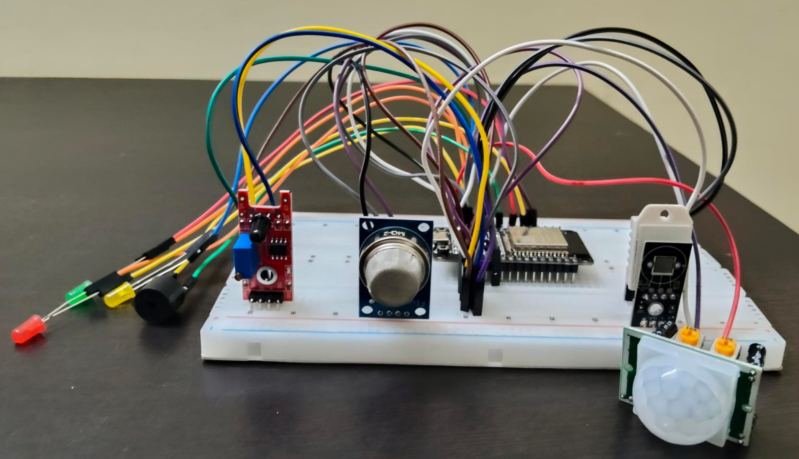
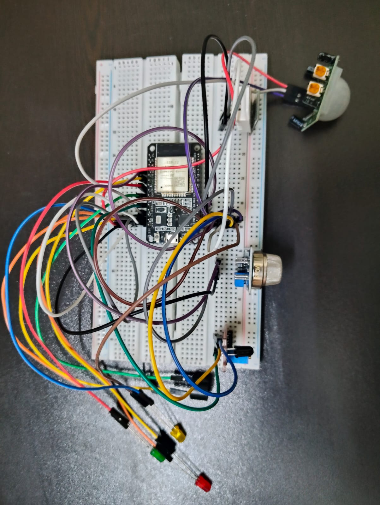

# KitchenGuard — AI-Powered Kitchen Safety System

> **"We don't react to disasters. We predict them."**

## Hardware Setup


<p align="center">
  
</p>

<p align="center">
  
</p>

> *Complete hardware setup: ESP32 on breadboard with MQ-2, PIR, Flame sensor, DHT22, LEDs and Buzzer*

---

## What is KitchenGuard?

KitchenGuard is an intelligent embedded IoT safety system that **predicts unattended cooking hazards in real-time before they escalate into dangerous situations.**

Most kitchen safety systems react *after* danger occurs. KitchenGuard uses a **Random Forest ML model** to analyze multi-sensor data patterns and classify risk levels *before* a situation becomes critical.

**Built by first-year engineering students — for the first time ever touching hardware.**

---

## Problem Statement

Every year, thousands of kitchen accidents occur not because of carelessness — but because of **distraction and forgetfulness**.

- Students multitasking
- Working professionals on calls  
- Elderly people who simply forgot

The stove stays on. Nobody notices. Until it's too late.

**Existing solutions fail because:**
- Manual timers need user discipline
- Basic smoke detectors react only after damage begins
- Premium smart kitchen devices are unaffordable

**KitchenGuard fills this gap** with a sub-₹1200 intelligent system that predicts danger before it happens.

---

##  System Architecture

```
┌─────────────────────────────────────────────────────┐
│                  SENSOR LAYER                       │
│  DHT22 │ MQ-2 │ HC-SR501 PIR │ KY-026 Flame        │
└────────────────────┬────────────────────────────────┘
                     │ Raw Sensor Data
                     ▼
┌─────────────────────────────────────────────────────┐
│              PROCESSING LAYER (ESP32)               │
│  Feature Engineering:                               │
│  • Temp-Gas Index = (Temp × Gas) / 1000             │
│  • Danger Score   = Σ threshold violations (0-4)    │
│  • Gas Normalized = Gas / 4095                      │
└────────────────────┬────────────────────────────────┘
                     │ 7 Engineered Features
                     ▼
┌─────────────────────────────────────────────────────┐
│              ML LAYER (Python Flask)                │
│  Random Forest Classifier                           │
│  • 4000 training samples                            │
│  • 99.87% accuracy                                  │
│  • 4 risk classes                                   │
└────────────────────┬────────────────────────────────┘
                     │ Risk Classification
                     ▼
┌─────────────────────────────────────────────────────┐
│              ALERT LAYER                            │
│  🟢 SAFE     → Green LED                            │
│  🟡 MODERATE → Yellow LED + 1 buzz                  │
│  🔴 HIGH RISK→ Red LED + 2 buzzes                   │
│  🚨 CRITICAL → Red LED + 5 buzzes                   │
└─────────────────────────────────────────────────────┘
```

---

## 🔌 Hardware Components

| Component | Model | GPIO | Role | Cost |
|-----------|-------|------|------|------|
| Microcontroller | ESP32 Dev Module (38-pin) | — | Brain + WiFi | ₹380 |
| Temperature/Humidity | DHT22 (AM2302) | GPIO 4 | Thermal monitoring | ₹150 |
| Gas/Smoke Sensor | MQ-2 | GPIO 34 | LPG + smoke detection | ₹70 |
| Motion Sensor | HC-SR501 PIR | GPIO 13 | Human presence | ₹65 |
| Flame Sensor | KY-026 | GPIO 14 | Direct fire detection | ₹50 |
| Buzzer | Active Buzzer 5V | GPIO 26 | Audio alert | ₹25 |
| Green LED | 5mm LED | GPIO 33 | SAFE indicator | ₹5 |
| Yellow LED | 5mm LED | GPIO 25 | MODERATE indicator | ₹5 |
| Red LED | 5mm LED | GPIO 32 | DANGER indicator | ₹5 |
| Breadboard | 400pt Mini | — | Prototyping | ₹80 |
| Jumper Wires | M-F 40pcs | — | Connections | ₹120 |

**Total Cost: ~₹955**

---

##  ML Model Details

### Algorithm: Random Forest Classifier

```
Training Samples  : 4,000 real-world kitchen scenarios
Features Used     : 7
Model Accuracy    : 99.87%
Risk Classes      : 4 (SAFE, MODERATE, HIGH_RISK, CRITICAL)
Framework         : scikit-learn
```

### Feature Engineering

| Feature | Formula | Purpose |
|---------|---------|---------|
| Temperature | Raw DHT22 (°C) | Thermal state |
| Humidity | Raw DHT22 (%) | Steam/evaporation indicator |
| Gas Level | Raw MQ-2 (0-4095) | LPG/smoke concentration |
| Motion Status | PIR digital (0/1) | Human presence |
| Flame Status | KY-026 digital (0/1) | Fire detection |
| **Temp-Gas Index** | `(Temp × Gas) / 1000` | Combined thermal-chemical risk |
| **Danger Score** | `Σ threshold violations` | Composite risk (0-4) |

### Risk Classification Logic

```
CRITICAL  → Fire + High Gas OR Extreme Temp + High Gas
HIGH_RISK → High Temp + High Gas OR No Person + High Gas
MODERATE  → No Person + Moderate Gas OR Rising Temp
SAFE      → All parameters within normal range
```

---

## Sample Serial Monitor Output

```
================================================
      KitchenGuard v1.0 AI Safety System
   Intelligent Unattended Cooking Monitor
================================================
[SYSTEM]  Microcontroller  : ESP32 Dev Module
[SYSTEM]  Firmware Version : v1.0.0
[ML]      Model Type       : Random Forest
[ML]      Model Accuracy   : 99.87%
[ML]      Risk Classes     : 4
================================================

[DIAG] Running startup diagnostics...
[DIAG] Checking DHT22 sensor.......... OK
[DIAG] Checking MQ2 gas sensor........ OK
[DIAG] Checking PIR motion sensor..... OK
[DIAG] Checking flame sensor.......... OK
[DIAG] Loading ML model weights....... OK
[DIAG] All diagnostics passed!

[READY] System monitoring active

================================================
           LIVE SENSOR READINGS
================================================
[DHT22]   Temperature  : 28.4 C    -> Normal
[DHT22]   Humidity     : 65.2 %    -> Normal
[MQ2]     Gas Level    : 342       -> Normal - Clean Air
[PIR]     Motion       : Person Present - Cooking Monitored
[FLAME]   Flame Sensor : No Flame Detected - Safe
------------------------------------------------
           ML MODEL ANALYSIS
------------------------------------------------
[FEATURE] Temp-Gas Index   : 9.70
[FEATURE] Danger Score     : 0 / 4
[FEATURE] Gas Normalized   : 0.083
------------------------------------------------
[ML]      Prediction       : SAFE
[ML]      Confidence       : 98.4 %
[ML]      Decision  : Normal cooking pattern
------------------------------------------------
[STATS]   Uptime          : 12 seconds
[STATS]   Total Readings  : 3
[STATS]   Avg Temp        : 28.3 C
[STATS]   Avg Humidity    : 65.1 %
================================================

[LED]     GREEN ON  -> Safe cooking
[STATUS]  No action required
```

---

##  Project Structure

```
KitchenGuard/
├── KitchenGuard.ino        ← ESP32 Arduino firmware
├── app.py                  ← Flask ML API server
├── ml/
│   ├── generate_data.py    ← Training data generator
│   └── train_model.py      ← Random Forest training script
├── model/
│   ├── model.pkl           ← Trained ML model
│   └── label_encoder.pkl   ← Label encoder
├── images/
│   └── hardware.jpg        ← Hardware setup photo
└── README.md
```

---

## Getting Started

### Prerequisites

```bash
# Python libraries
pip install flask scikit-learn pandas numpy

# Arduino Libraries (via Library Manager)
# - DHT sensor library by Adafruit
# - Adafruit Unified Sensor
# - ArduinoJson by Benoit Blanchon
```

### Step 1 — Generate Training Data

```bash
cd ml
python generate_data.py
```

### Step 2 — Train ML Model

```bash
python train_model.py
```
### Step 3 — Start Flask Server

```bash
cd ..
python app.py
```

### Step 4 — Upload Arduino Firmware

```
1. Open KitchenGuard.ino in Arduino IDE
2. Tools → Board → ESP32 Dev Module
3. Tools → Port → Select your COM port
4. Click Upload
5. Press BOOT button when "Connecting..." appears
6. Open Serial Monitor at 115200 baud
```

---

##  Pin Configuration

```
ESP32 LEFT SIDE:
├── GPIO 4  → DHT22 DATA
├── GPIO 13 → PIR OUT
├── GPIO 14 → Flame DO
├── GPIO 25 → Yellow LED (+)
├── GPIO 26 → Buzzer (+)
└── GPIO 33 → Green LED (+)

ESP32 RIGHT SIDE:
├── GPIO 32 → Red LED (+)
├── GPIO 34 → MQ2 AO
├── VIN     → MQ2 VCC + PIR VCC
└── GND     → All sensor GNDs
```

---

##  Troubleshooting

| Problem | Cause | Fix |
|---------|-------|-----|
| Brownout reset loop | Insufficient USB power | Use powered USB hub |
| MQ2 shows 4095 always | Sensor warming up | Wait 5 minutes |
| DHT22 shows ERROR | Wrong wiring | Check GPIO4 connection |
| Port not showing | Missing driver | Install CP2102 driver |
| LED not working | No resistor | Use 220Ω or PWM |
| BOOT error on upload | Timing issue | Hold BOOT during "Connecting..." |

---

##  Future Roadmap

- [ ] **Solenoid valve integration** — automatic gas shutoff on CRITICAL
- [ ] **TinyML deployment** — Random Forest directly on ESP32 (no server needed)
- [ ] **Mobile push notifications** — alert user via WhatsApp/SMS
- [ ] **Real kitchen data retraining** — production-grade model accuracy
- [ ] **OLED display** — live risk level on device screen
- [ ] **Cloud dashboard** — historical risk analytics

---


<div align="center">
⭐ Star this repo if you found it useful!

</div>
